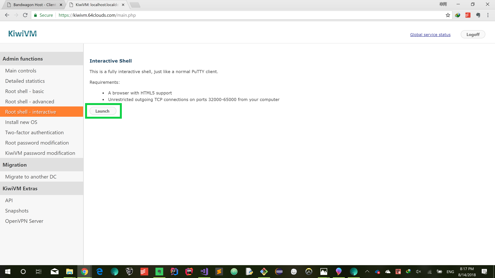
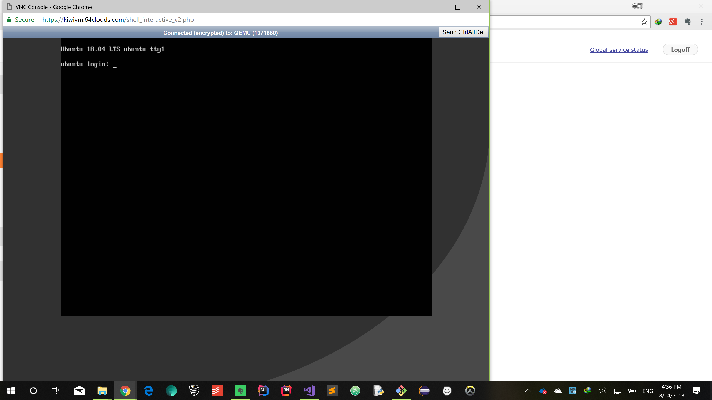
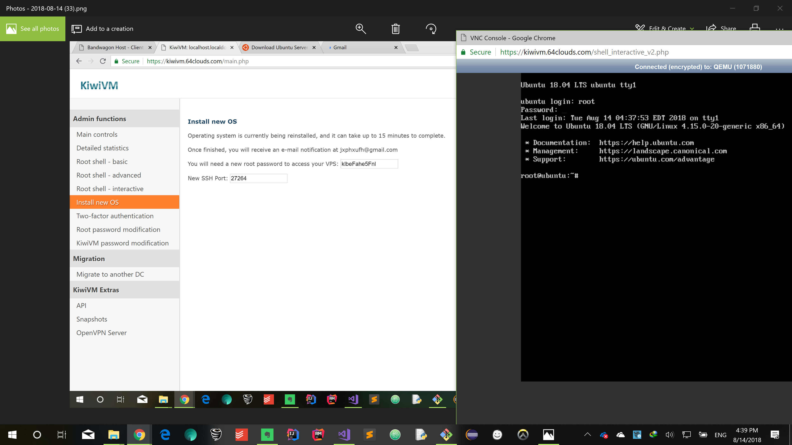
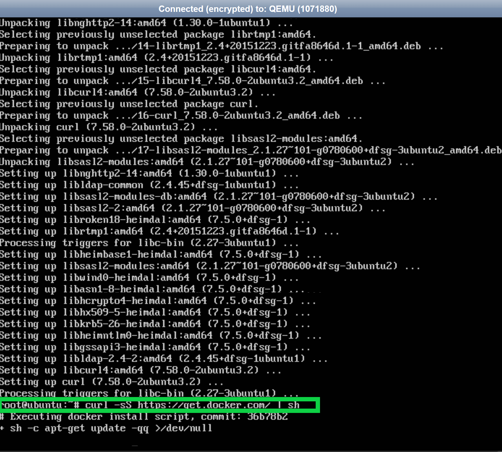
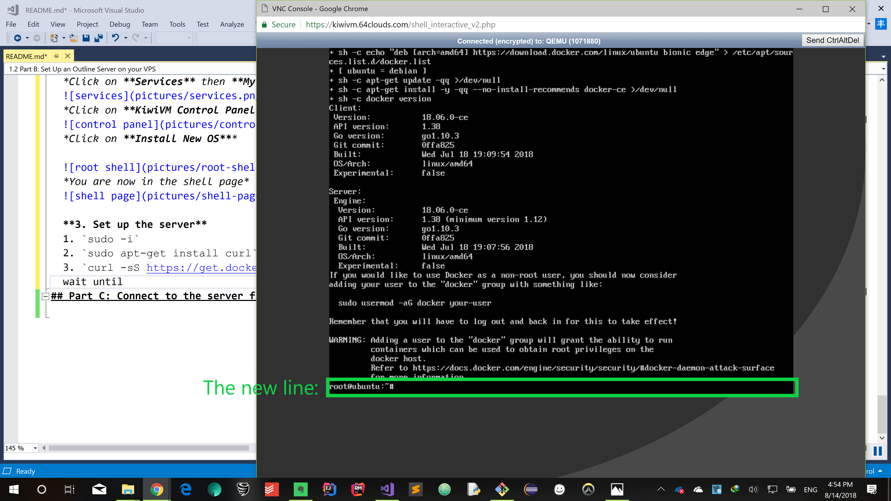
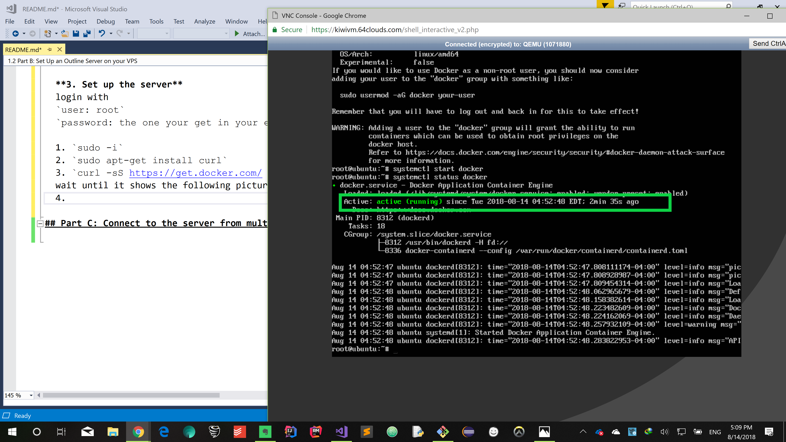
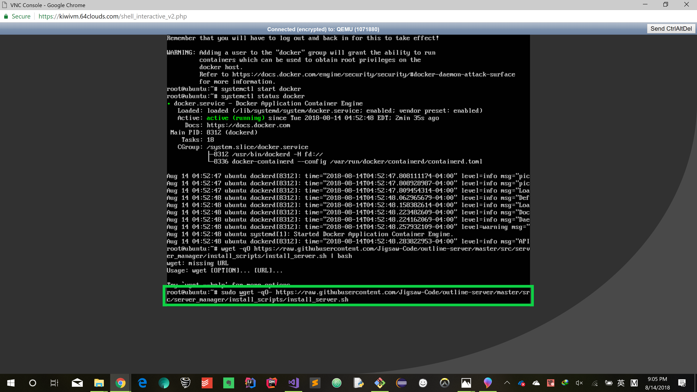
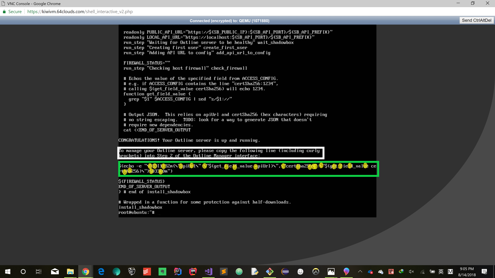

# Step by Step Tutorial
## Part A: Purchase a server from BandwagonHost
  **1. Open the [official website of BandwagonHost](https://bwh1.net/) in your web brouser**  
  *(Tips: you may have no access to https://bandwagonhost.com/, just try https://bwh1.net/ out.)*    
     

  **2. Select your preferred VPS([Virtual Private Server](https://en.wikipedia.org/wiki/Virtual_private_server)) option. Here we choose the first option(10G VPS), which I highly recommend**   
  *(Cautious: Some of these options are charged by quater or month instead of year, so pay attention if you'd like to select one of the rest.)*   
     

  **3. Click on [Order KVM or OpenVZ](https://bwh1.net/vps-hosting.php)**  
     

  **4. Click on the *Order [KVM](https://www.linux-kvm.org/page/Main_Page)* option in the first column of the table.**  *(Our Outline server will be on an Ubuntu distribution of Linux)*
     
 
  **5. Click on *Add To Cart***
      

  **6. Click on *Checkout***
     

  **7. Assuming you're not registered yet, fill in the forms to create an account and choose your payment method** *(Alipay is recommended for Chinese users)*
      

  **8. Click on *Pay Now***
    

  **9. Scan the Alipay QR payment code and finish your payment on your mobile phone or directly on your PC**
  
#### *After the payment, you are now ready to set up the server.*

## Part B: Set Up an Outline Server on your VPS   
  *After the payment, you should now be able to access the server you have just purchased.*  
  *Please follow the following steps to step up your server.* 
   
 **1.Log into your account**   
 *Click on the *Client Area* button on the upper right corner of the official website.*
  
 * *Log in with your email address and password that have been previously registered for your account in [<u>part A, step 7</u>](#register) of this tutorial.*  
 *Click on the Login button after you have filled in the forms.*
    

  **2. Install the right Operating System on your server**  
  *Click on **Services** then **My Services***  
  
  *Click on **KiwiVM Control Panel***
  
  *Click on **Install New OS***
   
   
  **3. Install new OS**  
  *Select **Ubuntu-18.04-x86_64**, which is at the bottom of the selection box. Then **check the agreement box** and finally left click **Reload**.*  
  
  *You should see something like below a few seconds later. The password and SSH port are important, so you may copy it on a paper or take a screenshot for later utility. (This information is also sent to your email, but may take some time, so keep it yourself just in case)*  
  

  **4. Log into the server**  
  *You may have to wait a few minutes and try several times before you can open the **interactvie root shell**.*
  
  *Just click the **Launch** button and wait a minute and click and wait and so forth until you see the window in the picture below.*
  
  *Login with the following information:*  
  `username: root`  
  `password: use the password you set down in step 3` [*<u>click here to review</u>*](#root-password)  
  *(When you enter the password, no character is shown explicitly but recorded internally for the sake of security.)*  
  
  *(A successful login looks like this)*

  **5. Configure the environment**  
  *It is time for us to code. Interactive shell reacts responsively whenever we input one line of code and stroke the enter key on our keyboard.
   So what you need to do is to enter the following code line by line and check if each one of these lines works correctly.*
  1. `sudo -i`   
  *You should get a new line as a response. Just continue to enter line 2.*
  2. `sudo apt-get install curl`   
  *wait a few seconds until a new line shows up.* 
  
  
  3. `curl -sS https://get.docker.com/ | sh`  
  *It may take quite a few minutes until you see something like the picture below.*
   
  4. `systemctl start docker`  
  *The same response as the 1st line.*
  5. `systemctl enable docker`  
  *The same response as the 1st line.*
  6. `systemctl status docker`  
  *If you see the green"active running", you are safe to continue.*
   
  
  **6. Set up the *Outline server***  
  Enter the following line of code in the shell. 
  `sudo wget -qO- https://raw.githubusercontent.com/Jigsaw-Code/outline-server/master/src/server_manager/install_scripts/install_server.sh | bash`
  
  *When you see something like this, copy the information in the green rectangle or take a screeshot of it for later use.*  
    
   

## Part C: Connect to the server from multiple platforms
  
  **1. Install the *Outline Manager* on your PC**  
  *Download the **Outline Manager**(It is Open Source) in the repository at the top of this web page.*